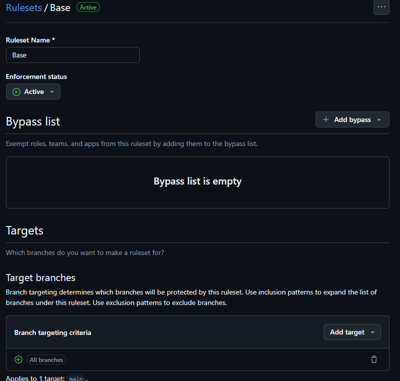
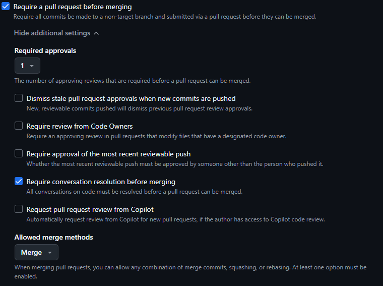
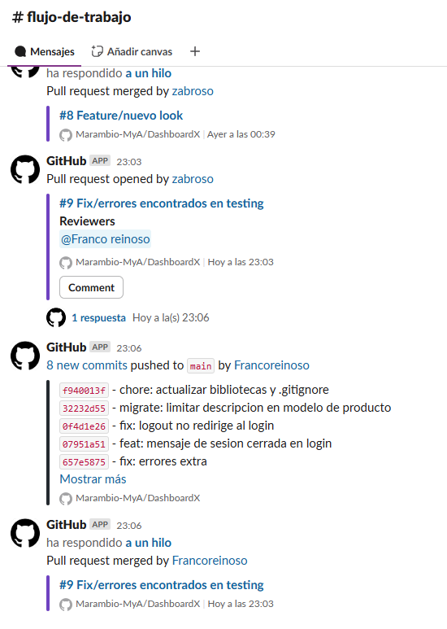
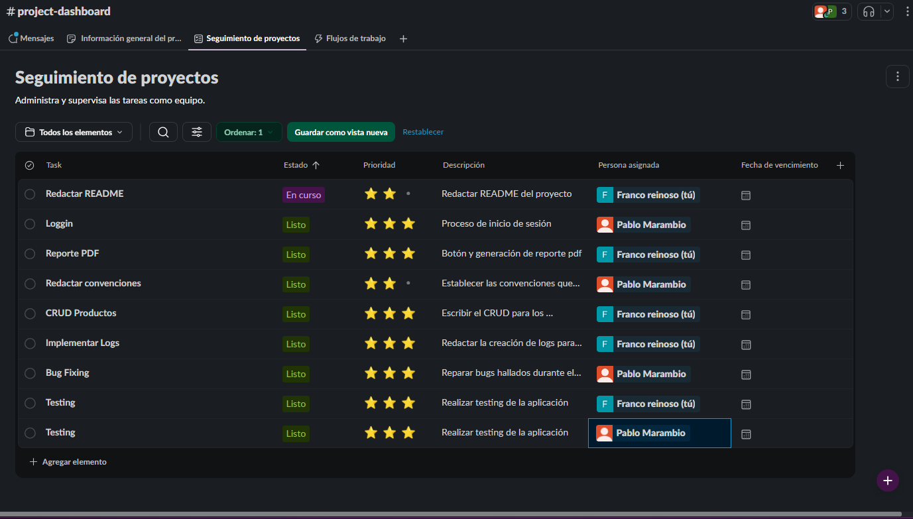

# Sistema de Gestión de Productos DashboardX

Pablo Marambio

Franco Reinoso


# Descripción del Proyecto

Estamos encargados de la creación de **gestión de inventario** para una pequeña empresa, es decir, una aplicación para **registrar productos** y **actualizar estos** cuando sea necesario.

## Público Objetivo

Esta aplicación está dirigida a un **emprendedor** que maneja una bodega en la cual hay un flujo de entrada y salida de productos.

## Funcionalidades de la Aplicación

Las funciones que cubrirá la aplicación son:

- **Agregar productos**.
- **Consultar productos**.
- **Actualizar productos**.
- **Eliminar productos**.
  
Además, permitirá:
- **Buscar productos por nombre**.
- **Filtrar productos** según la categoría y el stock disponible.

Contará con **protección de acceso** mediante un **inicio de sesión**.

Finalmente, tendrá la opción de generar un **reporte** que resuma su inventario.

## Requisitos

- Python 3.8 o superior

## Instalación

1. Clonar el repositorio:
```bash
git clone https://github.com/Marambio-MyA/DashboardX.git
cd dashboardx
```

2. Crear un entorno virtual:
```bash
python -m venv .venv
source .venv/bin/activate  # En Windows: .venv\Scripts\activate
```

3. Instalar dependencias:
```bash
pip install -r requirements.txt
```

4. Aplicar migraciones:
```bash
python manage.py migrate
```

5. Crear un usuario:
```bash
python manage.py createsuperuser
```

6. Ejecutar el servidor de desarrollo:
```bash
python manage.py runserver
```


# Requerimientos de la Aplicación

## 1️⃣ Gestión de Productos (CRUD)
Permitir a los usuarios crear, leer, actualizar y eliminar productos.

### Atributos obligatorios:
- **nombre** (texto).
- **descripción** (texto).
- **cantidad disponible** (entero, ≥ 0).
- **precio unitario** (entero, ≥ 0).
- **categoría** (texto, seleccionable entre categorías creadas previamente en la aplicación).

---

## 2️⃣ Gestión de Stock
Permitir actualizar la cantidad cuando:
- Se realicen **ventas** (disminuye stock).
- Se reciban **unidades** (aumenta stock).

**Regla importante:**  
- No permitir cantidades negativas.

---

## 3️⃣ Búsqueda y Filtrado
- Buscar productos por **nombre**.
- Filtrar productos por **categoría** y por **stock disponible**.

---

## 4️⃣ Reportes de Inventario
Generar reportes con la siguiente información:
- **Total de productos en inventario** (cantidad de todos los productos).
- **Valor total del inventario** (suma de `cantidad disponible × precio unitario` de todos los productos).
- **Lista de productos agotados** (productos con `cantidad disponible = 0`).

---

## 5️⃣ Autenticación de Usuarios
Implementar un sistema de inicio de sesión con usuario y contraseña.


# Mejorar la Especificación y Verificación de Requerimientos

## ¿Cómo especificar mejor el requerimiento? (Validación)
- Utilizar una **especificación** más detallada para describir el comportamiento esperado del sistema.
- A simple vista, **hay poca información** sobre cómo debe actuar el sistema en distintas situaciones.
- Es necesario **conversar más con el cliente** para entender el problema real que debe ser resuelto
Con estos puntos creemos que podríamos validar nuestro trabajo, es decir, confirmar si es que estamos resolviendo el problema correcto
---

## ¿Cómo asegurar que el programa cumpla el requerimiento? (Verificación)
- Asegurar que **las pruebas estén directamente relacionadas** con los requerimientos definidos.
- Definir **criterios de éxito claros** para cada requerimiento, de manera que:
  - Se pueda comprobar si el programa cumple correctamente lo esperado.
  - Se tenga una **guía objetiva** para evaluar si el problema fue resuelto de forma adecuada.
Con todo lo anterior podemos verificar que estamos resolviendo de forma correcta el problema

# Organización del Proyecto

En cuanto a la organización del proyecto:

- Nos reunimos para **entender en conjunto** el problema que teníamos frente a nosotros.
- Elegimos las **herramientas** que consideramos las mejores para resolverlo.
- Seleccionamos una **buena administración del código fuente** mediante **GitHub Flow**.

Posteriormente, organizamos los aspectos formales:

- Creación de un **espacio de trabajo en Slack**.
- Creación de una **organización en GitHub**.
- **Integración de GitHub con Slack** para mejorar la comunicación y seguimiento de cambios.

Para abordar los requerimientos, seguimos el siguiente orden:

1. Implementación del **CRUD de productos**.
2. Implementación del **inicio de sesión**.
3. Desarrollo de **filtros y búsquedas**.
4. Implementación de la **generación de reportes**.

# Testing 

Llegamos a los siguientes acuerdos en cuanto al testing de la aplicación: 

-Testear de forma manual
-Cada uno prueba lo que desarrolló (de forma individual)
-Preparar un conjunto final de pruebas a testear como equipo.

# Flujo de Trabajo y Configuración









## Configuración de Branch Protection

- En la primera imagen se muestra la configuración de **Branch Protection**.
- En la sección **Target branches** se indica que aplica a **todas las ramas**.
- Más abajo, se puede ver que:
  - Se requiere **al menos un approval** para aprobar cambios.
  - Es obligatorio **resolver todos los comentarios** antes de poder hacer merge.

## Integración de GitHub con Slack

- En la tercera imagen se evidencia la **integración entre GitHub y Slack**.
- En la última imagen se pueden ver los To-Do del equipo. 


# Problemas durante el Proyecto

El principal problema que enfrentamos fue una **mala elección de tecnologías**. 

Para un proyecto simple, el trabajo se complicó debido a un **uso incorrecto de los frameworks** seleccionados inicialmente.

# Solución

La solución fue **explorar una nueva forma de resolver el problema** y **reiniciar el proyecto desde cero** utilizando herramientas más adecuadas y un enfoque más simple.

